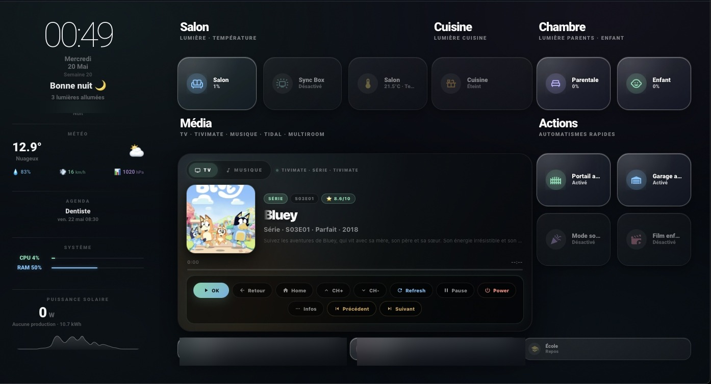
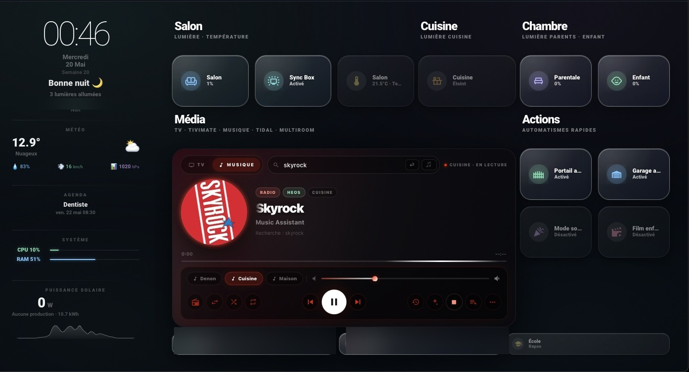
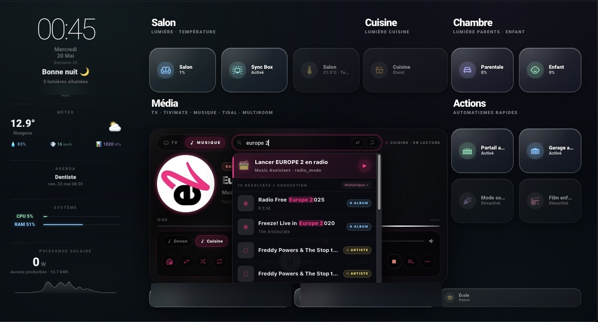
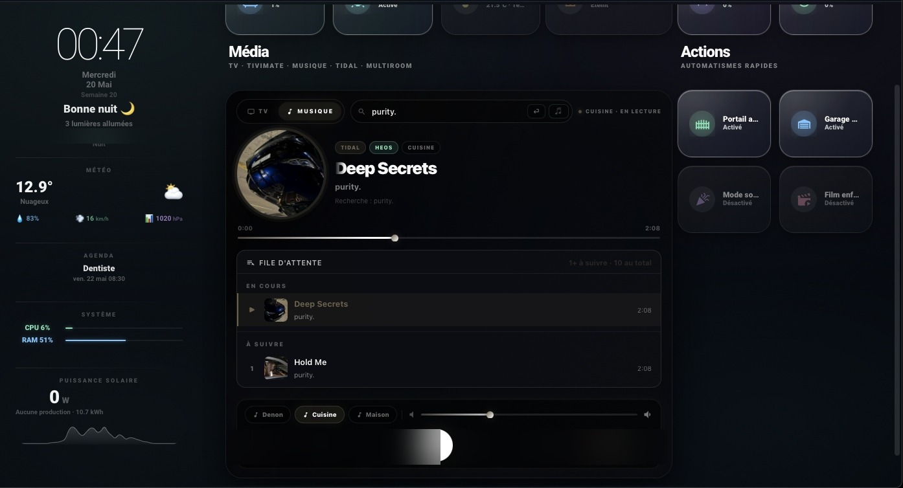
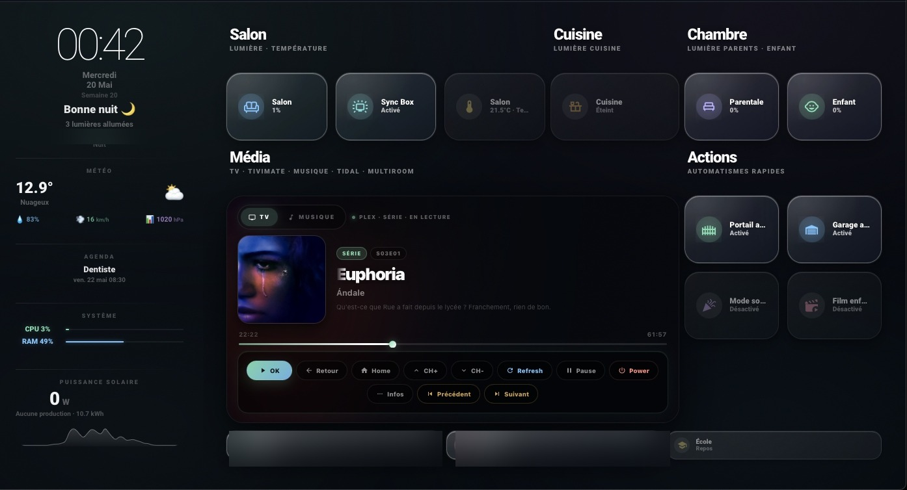
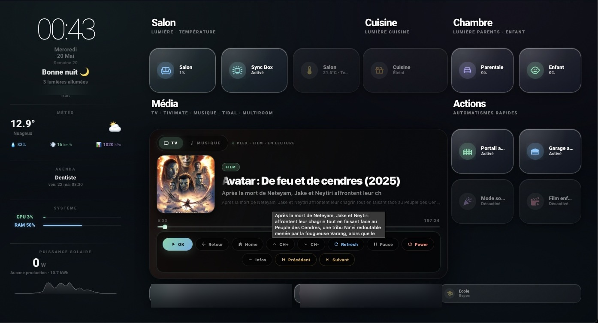
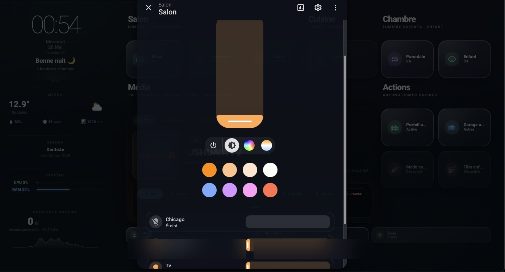

# 🏠 ha-obsidian — Dashboard Home Assistant

> Dashboard Home Assistant ultra-personnalisé avec lecteur média avancé, contrôle TV/Musique multiroom, lumières et automatisations.

[](https://ko-fi.com/lookair)

---

## 📸 Aperçu

### Vue principale


### 🎵 Lecteur Musique — Tidal via Music Assistant


### 📻 Recherche radio directe dans la barre de recherche


### 📋 File d'attente temps réel


### 📺 Lecteur TV — Série (Plex)


### 🎬 Lecteur TV — Film (Plex)


### 💡 Contrôle des lumières


---

## ✨ Ce que fait ce dashboard

### 🎵 Lecteur Média Premium V943

Un lecteur tout-en-un pour la musique **et** la TV, directement depuis le dashboard.

- 📻 **Radios françaises en un mot** — tape `skyrock`, `nrj`, `europe 2`… dans la barre de recherche → la radio démarre instantanément via Music Assistant, sans configuration supplémentaire
- 🎵 **Recherche musique complète** — titres, albums, artistes, playlists détectés automatiquement
- 🎨 **Ambiance dynamique** — le fond change de couleur selon la pochette de l'album en cours
- 📋 **File d'attente** — voir les prochains titres en temps réel
- 🔊 **Multiroom** — contrôle Ampli salon / Cuisine / Toute la maison
- 📺 **Télécommande TV** — contrôle Plex/Shield intégré avec infos du film ou de la série
- 🕑 **Historique** — 10 derniers titres écoutés mémorisés

### 💡 Lumières
Contrôle par pièce avec sélecteur de couleur et slider de luminosité.

### 🚪 Automatisations rapides
Portail, Garage, Mode sommeil, Film enfants, École — accessibles en un tap.

---

## 🚀 Installation étape par étape

> 💡 **Niveau débutant** — suis les étapes dans l'ordre, ça prend environ 10 minutes.

---

### Étape 1 — Télécharger les fichiers

Clique sur le bouton vert **`< > Code`** en haut de cette page → **Download ZIP** → décompresse le fichier.

---

### Étape 2 — Copier les fichiers JS dans Home Assistant

Tu as deux options :

**Option A — Via l'addon File Editor (recommandé)**
1. Dans HA → **Paramètres → Modules complémentaires** → installe **File Editor** si ce n'est pas fait
2. Ouvre File Editor → navigue jusqu'à `config/www/`
3. Si le dossier `www` n'existe pas, crée-le
4. Copie tous les fichiers `.js` du dossier `www/` de ce repo dans `config/www/`

**Option B — Via un accès réseau (Samba/SFTP)**
1. Monte le partage réseau de ton HA sur ton ordinateur
2. Copie les fichiers `.js` dans le dossier `www/`

---

### Étape 3 — Déclarer les ressources JavaScript

1. Dans HA → **Paramètres → Tableaux de bord**
2. Clique sur les **⋮** (3 points) en haut à droite → **Ressources**
3. Clique **+ Ajouter une ressource** pour chaque fichier JS :

| URL à coller | Type |
|---|---|
| `/local/media-premium-player-v943-PUBLIC.js` | Module JavaScript |
| `/local/media-premium-player-v9-4-1-PUBLIC.js` | Module JavaScript |
| `/local/agenda.js` | Module JavaScript |
| `/local/horloge-meteo.js` | Module JavaScript |
| `/local/solaire.js` | Module JavaScript |
| `/local/systeme.js` | Module JavaScript |

4. **Vide le cache** de ton navigateur (Ctrl+Shift+R ou Cmd+Shift+R sur Mac)

---

### Étape 4 — Importer le dashboard

1. Dans HA → **Paramètres → Tableaux de bord** → **+ Ajouter un tableau de bord**
2. Donne-lui un nom (ex: `Obsidian`)
3. Clique sur **⋮** → **Modifier** → passe en mode **YAML brut**
4. Copie-colle le contenu du fichier `dashboard_ha-obsidian.yaml`
5. Clique **Enregistrer**

---

### Étape 5 — Adapter à ton installation

> ⚠️ Les noms d'entités dans ce fichier sont **génériques**. Tu dois les remplacer par les tiens.

Cherche et remplace ces entités dans le YAML par celles de ton HA :

| Entité générique | Ce que tu dois mettre |
|---|---|
| `media_player.ampli_salon_3` | Ton ampli/enceinte principale |
| `media_player.enceinte_cuisine` | Ton enceinte cuisine |
| `media_player.groupe_maison` | Ton groupe multiroom |
| `media_player.android_tv_shield` | Ton Android TV / Shield |
| `media_player.plex_shield_tv` | Ton player Plex |
| `input_select.lecteur_musique` | Ton input_select de sélection de pièce |
| `input_text.recherche_musique` | Ton input_text de recherche |
| `script.media_lancer_musique` | Ton script de lancement musique |

Pour trouver tes entités : **Paramètres → Appareils et services → Entités** → recherche par nom.

---

### Étape 6 — Dépendances requises (HACS)

Installe ces intégrations via [HACS](https://hacs.xyz) si ce n'est pas déjà fait :

| À installer | Pourquoi | Lien |
|---|---|---|
| **Music Assistant** | Indispensable pour la musique et les radios | [music-assistant.io](https://music-assistant.io) |
| **ha-fusion** | Thème du dashboard | [GitHub](https://github.com/matt8707/ha-fusion) |
| **TiviMate Companion** | Infos TV en direct (optionnel) | HACS |
| **TMDB** | Pochettes films/séries (optionnel) | HACS |
| **Last.fm** | Suggestions artistes (optionnel) | HACS |

---

## 📻 Utiliser la recherche radio

Une fois installé, dans le lecteur musique :

1. Clique sur l'onglet **🎵 MUSIQUE**
2. Dans la barre de recherche, tape directement le nom d'une radio :

```
skyrock     → 🔴 Lancer Skyrock en radio
europe 2    → 🔴 Lancer Europe 2 en radio
nrj         → 🔴 Lancer NRJ en radio
fip         → 🔴 Lancer FIP en radio
chill       → 🎵 Playlist ambiance Chill
workout     → 🎵 Playlist ambiance Workout
```

3. Clique sur la suggestion qui apparaît → **c'est parti !**

> Aucun script HA à créer — Music Assistant s'en charge directement via Radio Browser.

---

## ❓ Problèmes fréquents

**Les cartes n'apparaissent pas / erreur "custom element not found"**
→ Vérifie que les fichiers JS sont bien dans `config/www/` et que les ressources sont déclarées (Étape 3). Vide le cache.

**La musique ne se lance pas**
→ Vérifie que Music Assistant est installé et qu'au moins un provider (Tidal, Spotify…) est configuré.

**Les entités sont en rouge / "unavailable"**
→ Les noms d'entités sont génériques. Remplace-les par les tiens (Étape 5).

---

## 📝 Changelog

### V943 — Mai 2026
- ✅ Fix `config_entry_id` pour Music Assistant 2.5+
- 📻 Recherche radio directe par nom (sans script)
- 🌟 Highlighting des résultats de recherche
- 📋 File d'attente multi-méthodes WebSocket + HTTP
- 🕑 Historique lecture persistant
- 🎨 Couleur dynamique selon pochette

### V941 — Mai 2026
- Version initiale publiée

---

## ☕ Soutenir le projet

Ce dashboard est gratuit et open-source. Si il t'a été utile, un café est toujours apprécié ! ☕

[](https://ko-fi.com/lookair)

---

## ⚠️ Avertissement

Les `entity_id` présents dans ce dépôt sont **anonymisés**. Ils ne correspondent pas à une vraie installation — remplace-les par les tiens.

---

*Fait avec ❤️ sous Home Assistant · Thème [ha-fusion](https://github.com/matt8707/ha-fusion)*
